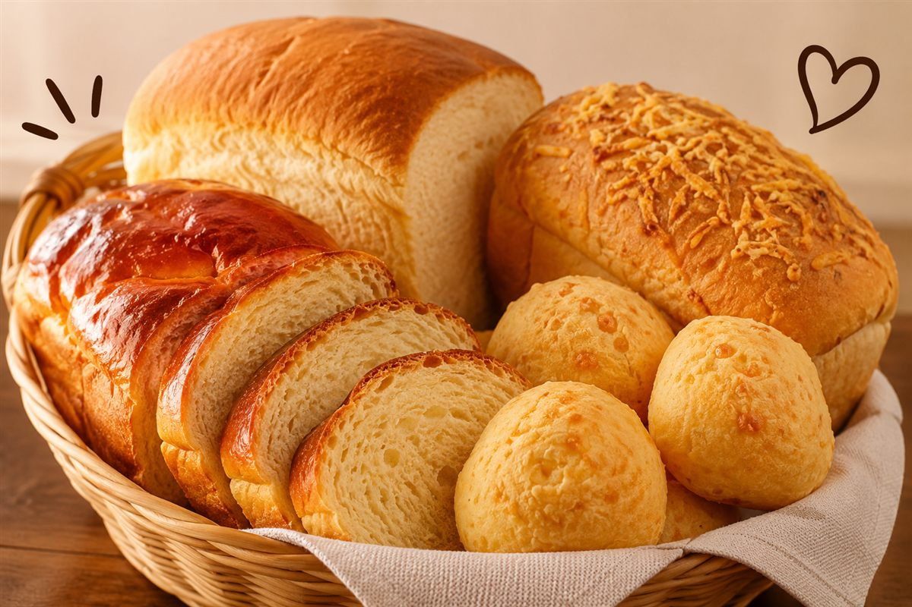

# 150 Receitas de Padaria — Máquina de Pão

Landing page da oferta *150 Receitas de Padaria Doces e Salgadas na sua Máquina de Pão*.
Site estático puro (HTML + CSS + JS), sem build.

Estrutura espelhada da referência `panificadora.donaneide.site`:
barra topo → hero → categorias → receitas → dor → bloco escuro "o que vem dentro"
→ bônus + faixa de valor → planos empilhados (básico → ponte → completo)
→ garantia → FAQ → fechamento escuro → rodapé.
Escala de fonte fixa: PC 40/35/30/25/20/18/16 · mobile 35/30/25/22/20/18/16
(o h1 da hero é caso à parte: 64px no PC, 40px no mobile).

```
index.html
assets/css/style.css
assets/js/main.js      ← links de checkout ficam aqui
netlify.toml
robots.txt
```

## Antes de rodar tráfego

1. **Links de checkout** — editar `CHECKOUT` no topo de `assets/js/main.js`:
   ```js
   var CHECKOUT = {
     basico:   'https://...',   // R$ 17,90
     completo: 'https://...'    // R$ 27,90
   };
   ```
   Sem isso os dois botões de plano não levam a lugar nenhum (avisa no console).
2. **Pixel / tracking** — colar a tag logo antes do `</body>` do `index.html`,
   nunca dentro de um `<script>` já existente.
3. **Imagens** — ver a seção abaixo. São 18 slots marcados na página.
4. **Domínio** — ajustar `og:url` / `canonical` no `<head>` depois de apontar o domínio.

## Imagens

Os slots estão marcados com um placeholder tracejado que mostra o nome do arquivo
esperado. Coloque os arquivos em `assets/img/` e troque a `div` por uma `img`,
mantendo as classes:

```html
<div class="media media--4x3 ph" data-img="hero.jpg">🍞</div>

```

`.media` cuida da proporção, dos cantos e do `object-fit: cover` — a foto pode ter
qualquer tamanho, desde que respeite o formato. Sugestão: 1200px no lado maior.

| Arquivo | Formato | Onde aparece |
|---|---|---|
| `hero.jpg` | 4:3 | topo da página — foto ambiente com o produto |
| `categoria-1..5.jpg` | 4:3 | os 5 cards de categoria |
| `receita-coxinha.jpg` | 4:3 | card "Massa de coxinha" |
| `receita-cuca.jpg` | 4:3 | card "Cuca" |
| `receita-fatia-hungara.jpg` | 4:3 | card "Fatia húngara" |
| `receita-cinnamon-roll.jpg` | 4:3 | card "Cinnamon roll" |
| `bundle.jpg` | 4:3 | bloco escuro "o que vem dentro" — mockup do pacote |
| `bonus-1..5.jpg` | 4:3 | capas dos 5 bônus |
| `plano-basico.jpg` | 4:3 | card do plano básico |
| `plano-completo.jpg` | 4:3 | card do plano completo (mockup com os bônus) |

Proporções disponíveis: `media--4x3`, `media--1x1`, `media--3x4`, `media--16x9`.

Os 10 chips de "E ainda" e os 7 do fechamento usam só emoji. Se quiser foto neles
também, é o mesmo padrão — trocar o `<span>` por uma `img.media.media--1x1`.

## Deploy no Netlify

Conectar o repositório (Add new site → Import from Git):

- **Build command:** vazio
- **Publish directory:** `.`

O `netlify.toml` já traz isso configurado, então o Netlify não pergunta nada.

## Preview local

```bash
npx serve .          # ou qualquer server estático
```
